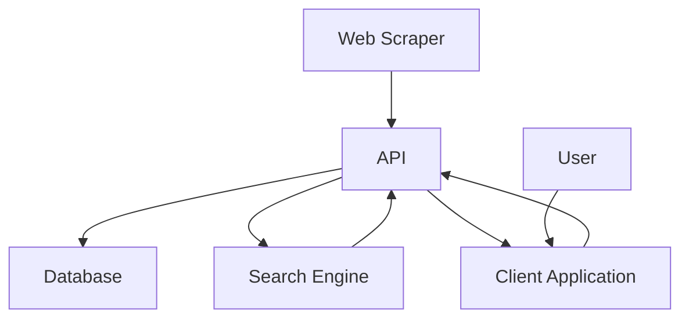

# AI Driven News Outlet

[`Client 🧑‍💻`](/client/README.md)
[`API 📨`](/server/README.md)
[`Scrapper ⛏️`](/scraper/README.md)
[`Search 🔍`](/search/README.md)
[`Database 📦`](/database/README.md)

> 2023 BIT Studio 5/6 Project by **Artem Kechemaev**, **Greg Seal**, **Georgette Watkins** and **Aardhyn Lavender**

<br/>

## Live Prototype

Our prototype site is now live.

[`Launch 🚀`](https://ai-daily-news.op-bit.nz/)

## Installation and Configuration

```shell
git clone https://github.com/RozadoStudioProjectsOP/ai_driven_news_outlet/
cd ai_driven_news_outlet
```

### Environment

#### Containerized Development

Configure the sections from `template.virtual.env` in `virtual.env` for running the modules though docker containers.

The only difference is the `_HOST` variables. As each module is running on its own container, **localhost** does not work. instead, their configured to the name of the container their trying to connect to (except the `client` connecting to the `api`, something weird going on there...).

This works because `docker-compose` creates a network with domain names for each container based on the name of the service in the `docker-compose.yml` file.

Copy and configure the `template.virtual.env` file

```shell
# in project root
cp template.virtual.env virtual.env # git ignore `virtual.env`
vim virtual.env # set undefined variables
```

#### Local

Configure the sections from `template.local.env` in `local.env` for running the modules on your local machine.

```shell
# in project root
cp template.local.env local.env # git ignore `local.env`
vim local.env # set undefined variables
```

Use whatever credentials you like for the `POSTGRES_USER` and `POSTGRES_PASSWORD` variables. You'll use these if you connect manually to the Database with `/database/scripts/attach.sh`.

The `/database/scripts/backup` script will ensure the the `BACKUP_DIR` directory exists before writing to it. You can set this to any directory you like.


## Execution

### Containerized

If you use `GNU Make`, you can use

```shell
make
# shorthand for 
make start
```

Or, use the scripts in `/scripts` (see `/scripts/README.md` for more information)

```shell
./script/start.sh
```

This builds the modules, runs each service in respective containers. The `scraper` module starts scraping, the `paraphraser` starts paraphrasing.

You might need to wait a bit before paraphrased articles start appearing in the client application.

Use `make clean` (`./script/clean.sh`) to delete everything. use `ctrl+c` (`SIGTERM`) to stop the containers forcefully.

> This deletes all containers, volumes, and images created by the `make start` task

use  `make restart` (`./script/clean.sh && ./script/start.sh`) to clean then start. This does not rebuild unchanged image layers.

### Local

You can run each service on your host machine too.

Checkout the installation and configuration instructions in each module to get started.

## Service Communication


