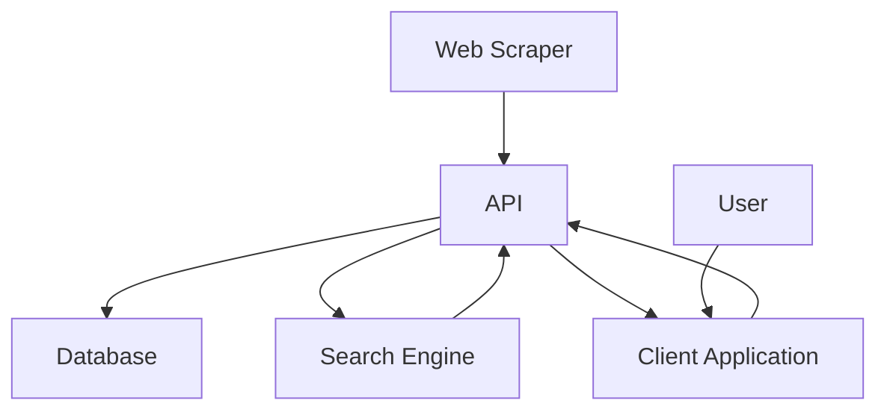

# AI Driven News Outlet

[`Client 🧑‍💻`](/client/README.md)
[`API 📨`](/server/README.md)
[`Scrapper ⛏️`](/scraper/README.md)
[`Search 🔍`](/search/README.md)
[`Database 📦`](/database/README.md)

> 2023 BIT Studio 5/6 Project by **Artem Kechemaev**, **Greg Seal**, and **Aardhyn Lavender**

<br/>

## Live Prototype

Our prototype site is now live.

[`Launch 🚀`](https://ai-daily-news.op-bit.nz/)

## Installation and Configuration

```shell
git clone https://github.com/RozadoStudioProjectsOP/ai_driven_news_outlet/
cd ai_driven_news_outlet
```

Configure the environment variables required by the modules of this project--check out the `README`s

use `.env` for host builds

use `container.env` for compose builds

### Docker Compose

If you use `GNU Make`, you can use

```shell
make
# or, for verbosity
make start
```

> Check out /scripts for non-make versions

This builds the modules, and runs each service in respective containers

Use this command to delete everything when your done.

```
make clean
```

> This deletes all containers, volumes, and images created by the `make start` task

### Local Development

You can run each service on your host machine too.

Checkout the installation and configuration instructions in each module to get started.

## Service Communication


